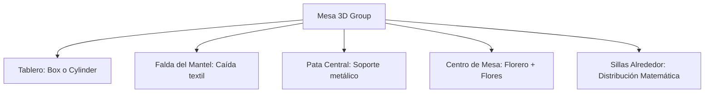

# Manual Técnico: Proyección Espacial e Interactiva 2D a 3D con Three.js

Este manual detalla los principios de diseño, arquitectura de software y metodologías matemáticas utilizadas para implementar el motor de proyección tridimensional en el **Planificador del Salón Jardín La Flor**. Está diseñado como referencia técnica para reproducir, escalar o adaptar este sistema a futuros proyectos de croquis y planos interactivos.

---

## 📌 1. Concepto Fundamental: El Mapeo de Coordenadas

El principal reto al crear un plano interactivo que se visualice simultáneamente en 2D (vectorial) y 3D (espacial fotorrealista) es establecer un **sistema de coordenadas unificado**.

### 📏 La Escala Real de Medición
En lugar de trabajar con unidades de píxeles arbitrarias, todo el estado de la aplicación se almacena en **metros reales**. Esto asegura la precisión arquitectónica.
*   **Espacio del Terreno:** $16.0\text{ m}$ (ancho) × $20.0\text{ m}$ (largo).
*   **Conversión a 2D (SVG):** Se usa un factor de escala $1\text{ metro} = 40\text{ píxeles}$.
    *   Ancho SVG: $16 \times 40 = 640\text{ px}$.
    *   Alto SVG: $20 \times 40 = 800\text{ px}$.
*   **Conversión a 3D (Three.js):** Se usa una relación directa de $1\text{ metro} = 1\text{ unidad de Three.js}$.

### 🔄 Transformación de Dimensiones y Ejes
El lienzo 2D en pantallas utiliza un plano cartesiano bidimensional $(X, Y)$ donde el origen $(0,0)$ está en la esquina superior izquierda y el eje $Y$ crece hacia abajo. 
El espacio 3D utiliza un plano tridimensional $(X, Y, Z)$ donde el plano del suelo está definido por los ejes $X$ y $Z$, y el eje $Y$ representa la altura (creciendo hacia arriba).

Para proyectar de 2D a 3D, aplicamos la siguiente equivalencia matemática:

$$\begin{aligned}
X_{3D} &= X_{2D\text{ (en metros)}} \\
Y_{3D} &= \text{Altura sobre el nivel del suelo (m)} \\
Z_{3D} &= Y_{2D\text{ (en metros)}} \\
\theta_{3D} &= -\theta_{2D\text{ (en radianes)}}
\end{aligned}$$

> [!NOTE]
> La rotación $\theta_{3D}$ se multiplica por $-1$ debido a que el plano 2D rota en sentido horario (clock-wise) y el espacio tridimensional de Three.js sigue la regla de la mano derecha (giro antihorario).

---

## 💡 2. Configuración del Entorno 3D (El Escenario)

El visor 3D se inicializa de forma dinámica en [visualizer3d.js](file:///c:/Users/quant/Documents/Jardin%20la%20flor/visualizer3d.js). Su estructura consta de:

```javascript
// 1. Escena con niebla exponencial para dar profundidad visual
scene = new THREE.Scene();
scene.background = new THREE.Color(0x0f172a); // Fondo azul pizarra oscuro premium
scene.fog = new THREE.FogExp2(0x0f172a, 0.02);

// 2. Cámara con perspectiva fotorrealista (Ángulo de 45° con relación de aspecto dinámica)
camera = new THREE.PerspectiveCamera(45, containerWidth / containerHeight, 0.1, 100);
camera.position.set(8, 16, 22); // Vista aérea oblicua en diagonal

// 3. Renderer con suavizado de bordes (Antialiasing) y soporte de sombras
renderer = new THREE.WebGLRenderer({ antialias: true });
renderer.setSize(containerWidth, containerHeight);
renderer.shadowMap.enabled = true;
renderer.shadowMap.type = THREE.PCFSoftShadowMap; // Sombras difusas/suaves premium
renderer.toneMapping = THREE.ACESFilmicToneMapping; // Mapeado de tonos estilo cinematográfico
```

### 🎮 Control de Cámara (OrbitControls)
Para permitir que el usuario vuele e interactúe con el salón en 3D, se integran los controles de órbita restringiendo el comportamiento de forma arquitectónica:
```javascript
controls = new THREE.OrbitControls(camera, renderer.domElement);
controls.enableDamping = true;          // Inercia o suavizado al girar la cámara
controls.dampingFactor = 0.05;
controls.maxPolarAngle = Math.PI/2 - 0.05; // Bloquea la cámara para que no atraviese el suelo
controls.target.set(8, 0, 10);          // Enfoca el pivote de la cámara en el centro exacto del salón
```

---

## ☀️ 3. Esquema de Iluminación y Sombras

Para lograr un acabado de alta gama, no basta con luz plana. Implementamos tres capas de luz complementarias:

1.  **Luz Ambiental (AmbientLight):** Proporciona una iluminación de relleno base suave en toda la escena para evitar sombras 100% oscuras difíciles de distinguir.
2.  **Luz Solar Direccional (DirectionalLight):** Simula la luz de un atardecer dorado (`0xffe8d6` a $0.8$ de intensidad). Es la encargada de proyectar las sombras alargadas y dramáticas de los muebles. Su mapa de sombra (*shadow frustum*) se ajusta exactamente para cubrir los 16x20m del terreno y evitar desperdicio de rendimiento WebGL.
3.  **Luz Focal Central (SpotLight):** Una luz morada/cálida enfocada en la pista de baile central ("AP"). Su haz de luz se estrecha en $45^\circ$ y proyecta sombras focalizadas de las personas o las mesas colindantes.
4.  **Luces de Guirnalda (PointLights):** Pequeños focos tridimensionales suspendidos en el aire a $3.8\text{ m}$ de altura que simulan bombillas colgantes y aportan pequeños destellos fotorrealistas.

---

## 🏗️ 4. Modelado Procedural en 3D

Para mantener el proyecto ligero, no cargamos archivos 3D pesados (.obj, .gltf) que saturarían el ancho de banda en teléfonos móviles. En su lugar, **construimos los objetos dinámicamente mediante código** combinando primitivas geométricas.

### 🍽️ A. Mesas Redondas y Cuadradas
Utilizamos una jerarquía de grupos (`THREE.Group`):
*   **Tablero:** Si es redonda, usamos `CylinderGeometry` con caras delgadas. Si es cuadrada, usamos `BoxGeometry`. El material posee una rugosidad media-alta (`roughness: 0.65`) para emular la tela del mantel y se colorea según la selección del usuario.
*   **Falda del Mantel:** Se genera un cilindro o cubo que cuelga un poco más abajo del tablero ($30\text{ cm}$) simulando la caída del mantel.
*   **Arreglo Floral:** Un cilindro cerámico blanco y una esfera superior texturizada de colores actúan como florero y follaje central.



### 🪑 B. Distribución Matemática de Sillas
Las sillas deben rodear la mesa de forma automática, sin importar la forma del tablero o la cantidad de sillas configuradas por el usuario.

#### Distribución Circular (Mesa Redonda)
Para posicionar $N$ sillas equidistantes alrededor de un círculo de radio $R$, se utiliza trigonometría polar. Para cada silla $i \in [0, N-1]$:

$$\begin{aligned}
\theta &= \frac{i \times 2\pi}{N} \\
X_{silla} &= \sin(\theta) \times (R + \text{Separación}) \\
Z_{silla} &= \cos(\theta) \times (R + \text{Separación}) \\
\text{Giro}_{Y} &= \theta + \pi
\end{aligned}$$

> En código JS:
> ```javascript
> const angle = (i * 2 * Math.PI) / numChairs;
> const chairX = Math.sin(angle) * chairOffset;
> const chairZ = Math.cos(angle) * chairOffset;
> const chairRotY = angle + Math.PI; // Mirando hacia el centro de la mesa
> ```

#### Distribución Rectangular (Mesa Cuadrada Imperial)
Para 10 personas en una mesa cuadrada de ancho $W$ y largo $H$, las posiciones se distribuyen de forma lineal por lados:
*   **Lado Superior (3 sillas):** Espaciadas linealmente en $X$ a una distancia fija en $-Z$.
*   **Lado Inferior (3 sillas):** Espaciadas linealmente en $X$ a una distancia fija en $+Z$, rotadas $180^\circ$.
*   **Lado Izquierdo (2 sillas):** Espaciadas linealmente en $Z$ a una distancia fija en $-X$, rotadas $-90^\circ$.
*   **Lado Derecho (2 sillas):** Espaciadas linealmente en $Z$ a una distancia fija en $+X$, rotadas $90^\circ$.

---

## 🔄 5. Motor de Sincronización en Tiempo Real

Para lograr una interactividad fluida, la escena 3D no se reconstruye por completo en cada movimiento (eso causaría caídas severas de fotogramas por segundo, FPS). En su lugar, el visor mantiene un caché de referencias de mallas activas (`active3dElements`):

```javascript
let active3dElements = {}; // Almacena { id: THREE.Group }
```

Cuando se invoca `syncWithData(elementsArray)` desde [app.js](file:///c:/Users/quant/Documents/Jardin la flor/app.js):

1.  **Limpieza de Elementos Eliminados:** Se contrasta la lista de IDs del 3D contra los datos del plano 2D. Cualquier ID que ya no exista es removido de la escena y del diccionario mediante:
    ```javascript
    scene.remove(active3dElements[id]);
    delete active3dElements[id];
    ```
2.  **Actualización Incremental de Posiciones:** Para los elementos que ya existen, simplemente actualizamos sus propiedades espaciales básicas en un instante:
    ```javascript
    const group = active3dElements[elem.id];
    group.position.set(elem.x, 0, elem.y);
    group.rotation.y = - (elem.rotation * Math.PI / 180);
    ```
3.  **Reconstrucción Parcial por Cambios Estructurales:** Si el usuario modifica parámetros geométricos estructurales (como cambiar la forma de la mesa de cuadrada a redonda, modificar la cantidad de sillas o alterar el color del mantel), se detecta la discrepancia en `userData`, se eliminan los hijos de ese grupo específico y se reconstruye el modelo de forma localizada usando `build3DElement()`, dejando el resto de la escena intacto.

---

## ⚡ 6. Recomendaciones Técnicas para Futuros Proyectos

Si replica esta arquitectura en otros planos o croquis (como distribución de oficinas, estacionamientos, tiendas departamentales o naves industriales), implemente las siguientes directrices de optimización:

*   **Instancia de Mallas (InstancedMesh):** Si planea renderizar más de 50 mesas o sillas idénticas en la escena, no use grupos independientes. Utilice `THREE.InstancedMesh` para dibujar todas las sillas en una sola llamada de dibujo (Draw Call) al procesador gráfico (GPU). Esto aumentará la fluidez exponencialmente en teléfonos de gama baja.
*   **Encapsulado de Modelos:** Para objetos estáticos inamovibles (como muros perimetrales, escaleras o barras de cocina), consolide todas las geometrías en una única malla combinada (`THREE.BufferGeometryUtils.mergeBufferGeometries`), lo cual reduce el consumo de procesamiento de CPU drásticamente.
*   **Sombras Selectivas:** No proyecte sombras en pequeños detalles como copas, cubiertos o arreglos florales microscópicos. Configure `castShadow = true` únicamente en los volúmenes principales (tableros de mesas, respaldos de sillas, muros y altavoces).
